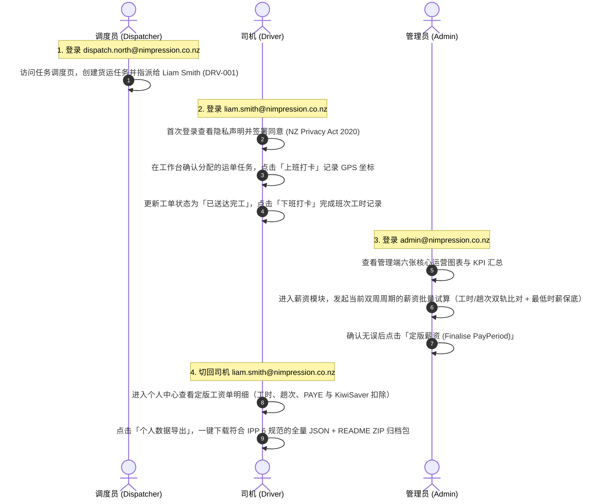

# Nimpression Ops — 智能运输与合规管理平台

> 新西兰本地货运物流、排班考勤、薪资试算、合规追踪与实时派单平台。  
> 采用 **.NET 10 (Minimal API + Clean Architecture)** 后端与 **Angular 19** 前端构建，深度对齐新西兰《Privacy Act 2020》隐私与数据主权合规标准。

---

## 🚀 五分钟跑起来（Quickstart）

### 1. 前置环境要求
在本地运行前，请确保已安装以下开发工具：
- **Docker 运行环境**：[Colima](https://github.com/abiosoft/colima) 或 Docker Desktop（macOS 推荐 `colima start --cpu 4 --memory 8`）
- **Task 任务运行器**：[Task](https://taskfile.dev)（`brew install go-task/tap/go-task`）
- **.NET SDK**：.NET 10.0+（`dotnet --version`）
- **Node.js & 包管理器**：Node.js 20+ 及 pnpm 9+（`npm install -g pnpm`）

---

### 2. 极速启动命令（可直接复制粘贴）

依次执行以下命令完成环境初始化与服务启动：

```bash
# 1. 启动 Docker 依赖服务（PostgreSQL 16 / Mailpit / MinIO S3）并初始化存储桶
task up

# 2. 将数据库迁移应用到本地 PostgreSQL 数据库
task migrate

# 3. 灌入 90 天确定性演示业务数据（13 用户 / 10 司机 / 11 车辆 / 6 区域 / 600+ 工单与考勤）
task seed

# 4. 一键启动全栈开发环境（同时启动 .NET 后端 API 与 Angular 前端）
task dev
```

运行 `task dev` 后，终端会输出以下服务访问地址：
- **前端控制台 (Angular)**: [http://localhost:4200](http://localhost:4200)
- **后端 API (.NET 10)**: [http://localhost:5080](http://localhost:5080)（健康检查: `/health`，OpenAPI: `/openapi/v1.json`）
- **本地邮件捕获 (Mailpit)**: [http://localhost:8025](http://localhost:8025)
- **对象存储控制台 (MinIO)**: [http://localhost:9001](http://localhost:9001)（默认账号/密码: `nimpression` / `devonly_change_me`）

> **提示**：按 `Ctrl + C` 可一次性干净关闭前端与后端子进程。若需要彻底重置数据库并清空数据卷，可执行 `task nuke`。

---

### 3. 预置演示账号一览

数据库预置了三个角色的典型账号（统一密码均为 `Passw0rd!demo`）：

| 角色 | 演示邮箱 | 初始密码 | 角色说明与职责 |
|---|---|---|---|
| **Admin（系统管理员）** | `admin@nimpression.co.nz` | `Passw0rd!demo` | 拥有全局权限：运营看板、薪资定版、数据分级与离职司机不可逆匿名化 |
| **Dispatcher（调度员）** | `dispatch.north@nimpression.co.nz` | `Passw0rd!demo` | 调度与运力管理：创建派单任务、指派司机车辆、监控实时状态 |
| **Driver（物流司机）** | `liam.smith@nimpression.co.nz` | `Passw0rd!demo` | 司机移动工作台：班次打卡、工单确认与完工、事故报告与个人数据导出 |

---

### 4. 建议的人工端到端验收路径（E2E Walkthrough）

打开浏览器访问 [http://localhost:4200](http://localhost:4200)，按照以下业务闭环体验核心功能：



---

### 5. 核心功能与亮点体验

1. **管理端多维运营仪表盘**：
   - 登录 Admin 账号后可查看 **6 张核心业务图表**（运力负荷率、打卡准点率趋势、区域任务热度、薪资双轨对比、事故/罚单合规雷达、逾期提醒）。
2. **多语言与深浅色主题切换**：
   - 导航栏右上角支持一键切换 **English / 中文**（全站 i18n 字典覆盖，符合 F13.2 双语规范）。
   - 支持 **深色模式 (Dark Theme) / 浅色模式 (Light Theme)** 无缝切换。
3. **本地系统邮件捕获 (Mailpit)**：
   - 打开 [http://localhost:8025](http://localhost:8025)，可实时查看系统触发的各类通知邮件（如合规到期提醒、重大事故理赔通报、密码重置通知等）。
4. **NZ Privacy Act 2020 隐私合规与数据主权**：
   - 手机号、住址、紧急联系人、车辆 VIN 均采用 **AES-256-GCM 字段级强加密**，数据库底层全为密文。
   - 离职司机执行不可逆脱敏替换（如 `Driver #a1b2c3`），且历史工资单 `SUM(GrossPay)` 与事故记录数 100% 恒定守恒。
   - 90 天前打卡 GPS 坐标定期清理，默认必须以 Dry-Run 模式安全评估。

---

## 🛠️ 常用开发任务清单（Task 命令）

| 命令 | 描述 |
|---|---|
| `task up` | 启动全部依赖容器（Postgres 5432 / Mailpit 8025 / MinIO 9001） |
| `task down` | 停止依赖容器（保留数据库数据卷） |
| `task nuke` | 停止容器并**彻底删除**本地数据卷（不可逆数据重置） |
| `task build:server` | 构建 .NET 10 后端解决方案（`TreatWarningsAsErrors=true`） |
| `task build:web` | 构建 Angular 19 前端工程 |
| `task test:server` | 运行全量 .NET 测试（Domain + Application + Integration） |
| `task test:unit` | 仅运行 .NET 单元测试（极速反馈，无需依赖容器） |
| `task test:integration` | 运行 .NET 集成测试（自动启动 Testcontainers 隔离数据库） |
| `task test:web` | 运行 Angular 单元测试 |
| `task test:e2e` | 运行 Playwright 端到端测试 |
| `task seed` | 灌入 90 天确定性演示业务数据 |
| `task dev` | **一键启动全栈开发环境**（依赖 + 后端 API 5080 + 前端 Dev Server 4200） |
| `task fmt` | 代码自动格式化（.NET C# + 前端 TypeScript/HTML/SCSS） |
