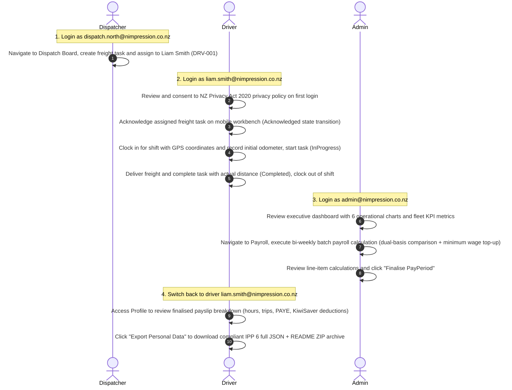

# Nimpression Ops — Logistics Fleet & Compliance Operations Platform

[English](README.md) | [简体中文](README.zh-CN.md)

> Intelligent freight logistics dispatching, attendance timesheets, bi-weekly payroll calculation, compliance tracking, and realtime operational telemetry platform tailored for New Zealand transport operators.  
> Built with **.NET 10 (Minimal API + Domain-Driven Design / Clean Architecture)** backend and **Angular 22 (Signals + Zoneless + PrimeNG)** frontend, strictly aligned with the **NZ Privacy Act 2020** data sovereignty and privacy principles.

---

## Overview & Core Capabilities

Nimpression Ops delivers full-lifecycle digital operations for small-to-medium transport fleets:

- **State Machine Task Dispatching**: Enforces strict domain lifecycle states (Draft -> Assigned -> Acknowledged -> InProgress -> Completed), offline idempotent replay, cross-territory assignment compliance warnings, and unacknowledged task escalation alerts.
- **NZ Statutory Dual-Basis Payroll**: Compliant with the *Holidays Act 2003* and *Minimum Wage Act*. Executes automated dual-basis comparison (Hourly vs. Piece-Rate / Per-Trip), awards the higher earnings while preserving complete line-item breakdown of both schemes, and enforces statutory minimum wage top-up protection.
- **Field-Level Encryption & Data Sovereignty**: Strictly adheres to the 13 Information Privacy Principles (IPPs) of the *NZ Privacy Act 2020*. PII fields are protected by AES-256-GCM authenticated encryption (with `enc:v1:` prefix). Supports irreversible departed driver anonymization (preserving aggregate financial and incident figures), retention cleanup (with default Dry-Run safety evaluation), and full IPP 6 personal data ZIP archive export.
- **Realtime Telemetry & Cache Invalidation Architecture**: SignalR-powered operational collaboration. Pushed messages act purely as lightweight cache invalidation signals, triggering clients to refetch authoritative state via HTTP and preventing business corruption during transport disconnects.
- **Bilingual Support & Accessibility**: Full bilingual dictionary coverage (`en-NZ` / `zh-CN`), seamless dark / light theme switching, and strict adherence to WCAG 2.1 AA color contrast standards (body text >= 4.5:1).

---

## System Architecture

```
                        +-----------------------------------------+
                        |      Client Applications (Web / PWA)    |
                        |   Angular 22 · Signals · Zoneless · CSS |
                        +--------------------+--------------------+
                                             |
                   HTTP/JSON REST Calls      |  SignalR Push (Invalidation)
                                             v
                        +-----------------------------------------+
                        |       Nimpression.Api (.NET 10)         |
                        | Minimal API · JWT · Rate Limiter · Auth |
                        +--------------------+--------------------+
                                             |
                                             v
                        +-----------------------------------------+
                        |     Nimpression.Application (MediatR)   |
                        | Commands · Queries · Pipeline Behaviors |
                        +--------------------+--------------------+
                                             |
                                             v
                        +-----------------------------------------+
                        |       Nimpression.Domain (Core)         |
                        | Entities · Aggregates · Value Objects   |
                        +--------------------+--------------------+
                                             |
                                             v
                        +-----------------------------------------+
                        |     Nimpression.Infrastructure (EF)     |
                        | PostgreSQL 16 · MinIO S3 · Mailpit SMTP |
                        +--------------------+--------------------+
```

| Layer | Technologies | Key Architectural Patterns & Responsibilities |
|---|---|---|
| **Frontend Presentation** | Angular 22 (`^22.1.0`), PrimeNG, ECharts | Zoneless architecture powered by Angular Signals reactive state management. Dual shell layout (Desktop Admin/Dispatcher Shell and Mobile-first Driver PWA Shell). Tested with Vitest. |
| **API & Gateway** | ASP.NET Core 10 Minimal API | Automatic assembly discovery and mounting via `IEndpointModule`; zero controller overhead; fixed-window IP rate limiting; HttpOnly cookie-based token rotation. |
| **Application Layer** | MediatR, FluentValidation | CQRS pattern. Pipeline behaviors enforce transactional boundaries (`ICommandMarker`), tamper-evident audit logging (`IAuditableCommand`), and model validation. Result pattern for domain outcomes (no exception-driven flow). |
| **Domain Core** | Pure C# Domain POCOs | Zero external dependencies. Aggregate roots enforce lifecycle state machines and invariants. Strongly typed value objects (Money, Kilometres, Rego, etc.) encapsulate domain rules. |
| **Infrastructure** | EF Core 10, PostgreSQL 16 | AES-256-GCM transparent field-level converter. Transactional Outbox pattern guarantees atomicity between database writes and domain event dispatching. Append-only database triggers for audit tables. |

---

## Eleven Build-Time Architectural Guards

The build pipeline (`pnpm build`) enforces **eleven automated architectural guards**. Each guard was forged from a real incident during development and iteration (see `_design/09-gap-analysis.md`), ensuring that policies and architectural boundaries are mechanically validated on every build:

| Guard Script | Verification Scope | Incident Context & Rationale |
|---|---|---|
| `check-hardcoded-secrets.mjs` | Scans all `.cs/.ts/.js/.json/.yml/.sh` files for hardcoded production passwords, private keys, JWT secrets, and connection string credentials. | Prevents credential leaks in git history. Mandates environment variables or explicit `dev-only-insecure...` / `// allow-hardcoded: <reason>` annotations. Caught high-severity CVE dependencies and dev credential leakage. |
| `check-api-contract.mjs` | Statically extracts all frontend `/api/` calls and validates them against the registered backend Minimal API route definitions. | **W18 Incident**: Frontend mock unit tests passed with 100% green status, but frontend called 9 non-existent backend endpoints, resulting in an empty driver app. This guard caught all 9 missing endpoints before fix. |
| `check-enum-contract.mjs` | Verifies exact naming and value symmetry between C# domain enum members and TypeScript union types / dictionary mappings. | **W11 Incident**: Backend serialized enums as integers while frontend defined string union types, breaking status badges across 11 pages in production. |
| `check-i18n.mjs` | Verifies complete bidirectional key symmetry between `en-NZ.json` and `zh-CN.json` translation dictionaries. | Prevents missing translation keys from causing blank labels or fallback failures when switching languages. |
| `check-i18n-keys.mjs` | Statically scans all HTML templates and TypeScript code for referenced i18n keys (including dynamic prefix expansions) against translation dictionaries. | **W31 Incident**: Symmetry checks (Guard 4) had a blind spot — when both dictionaries simultaneously missed 10 keys, the set difference was empty, rendering raw key identifiers to users. This guard closes the loop. |
| `check-emoji.mjs` | Scans source code, templates, documentation, and configuration to prohibit emoji characters. | **Strict Project Standard**: Emojis render inconsistently across operating systems, pollute screen reader outputs, and conflict with enterprise design systems. Mandates inline SVGs (`currentColor` + `aria-hidden="true"`) or plain text. |
| `check-design-tokens.mjs` | Validates that all `var(--token)` CSS variable references are declared in `tokens.scss` or `theme.scss`. | Prevents misspelled or dangling CSS custom properties from causing UI layout and style collapse. |
| `check-hardcoded-colors.mjs` | Scans all `.scss` and `.html` style definitions to prohibit raw `#hex`, `rgb()`, `rgba()`, and `hsl()` color literals. | **W31 Incident**: Developers bypassed design system tokens by hardcoding hex colors across 14 files, undermining theme consistency. This guard mandates token usage, allowing exemptions only via explicit single-line comments. |
| `check-contrast.mjs` | Parses light and dark mode color token hierarchies and calculates text-to-background contrast ratios using WCAG 2.1 algorithms. | **W21 Incident**: Even with variables, light theme primary button text on primary background achieved only 4.10:1 (failing the WCAG AA body text requirement of 4.5:1). |
| `check-realtime-wiring.mjs` | Scans list and metric components to verify that all views reflecting realtime data subscribe to corresponding SignalR invalidation signals. | **W19 Incident**: Backend SignalR infrastructure was fully deployed, but 7 frontend views had 0 subscriptions, requiring manual browser refreshes to view new data. |
| `check-dispatch-lifecycle-events.mjs` | Scans the domain `JobTask` aggregate root to ensure every lifecycle transition method explicitly calls `AddDomainEvent`. | **W24 Incident**: Modifying entity status without publishing domain events broke realtime notification pipelines and transactional outbox message publishing. |

---

## Role Permissions & Pre-configured Demo Accounts

Access control is strictly governed by RBAC and data sovereignty boundaries:

| Role | Demo Email | Initial Password | Core Responsibilities & Capabilities | Explicit Permission Restrictions |
|---|---|---|---|---|
| **Admin (System Administrator)** | `admin@nimpression.co.nz` | `Passw0rd!demo` | Global system control: executive dashboards and 6 operational KPI charts, bi-weekly pay period creation/calculation/finalisation/voiding, driver employment profiles and pay rate maintenance, vehicle catalog and compliance records, irreversible driver data anonymization, retention cleanup execution, append-only audit event queries and CSV export, system announcement publishing, email template management. | None. |
| **Dispatcher** | `dispatch.north@nimpression.co.nz`<br>`dispatch.south@nimpression.co.nz` | `Passw0rd!demo` | Fleet dispatching & operational coordination: creating freight tasks, assigning drivers and trucks, handling cross-zone assignment warnings, cancelling tasks, monitoring unacknowledged task alerts, checking driver dispatch eligibility and licence expiry alerts, vehicle assignment and release, operational area management, traffic fine review (start review/accept/dispute/waive), incident reporting and insurance notification tracking, partner contact management, manual compliance scan triggers. | **Payroll is completely inaccessible (Strict HTTP 403 Forbidden)**: Cannot view pay periods, cannot calculate/finalise/void payroll, cannot view fleet or driver payslips and pay rates; cannot create/modify driver profiles or rates; cannot create/modify vehicle catalog and service logs; cannot edit email templates; cannot view global audit logs; cannot execute retention cleanup or anonymization. |
| **Driver** | `liam.smith@nimpression.co.nz` (DRV-001) | `Passw0rd!demo` | Mobile-first Driver Workbench: shift clock-in/out with GPS (and location-unavailable fallback), viewing assigned tasks (`/my-tasks`), acknowledging tasks (`Acknowledged`), starting tasks with initial odometer (`InProgress`), completing tasks with actual distance (`Completed`), recording truck odometer readings with odometer photos, submitting traffic infringement tickets with photos, reporting safety incidents with accident photos, viewing own finalised payslips, downloading personal data ZIP archive under NZ Privacy Act IPP 6, signing privacy policy consent, self-updating contact details. | Strict tenant and user isolation: Attempting to access tasks, timesheets, fines, or payslips belonging to other drivers returns HTTP 403 Forbidden; strictly forbidden from altering employee numbers, pay rates, licence expiry dates, or employment status. |

---

## Quickstart (Five Minutes to Run)

### 1. Prerequisites

Ensure the following development tools are installed locally:
- **Container Runtime**: [Colima](https://github.com/abiosoft/colima) (recommended: `colima start --cpu 4 --memory 8`) or Docker Desktop
- **Task Runner**: [Taskfile](https://taskfile.dev) (`brew install go-task/tap/go-task`)
- **.NET SDK**: .NET 10.0+ (`dotnet --version`)
- **Node.js & Package Manager**: Node.js 22+ and pnpm 11+ (`corepack enable`)

---

### 2. Startup Commands

```bash
# 1. Start Docker dependencies (PostgreSQL 16 / Mailpit / MinIO S3) and initialize storage bucket
task up

# 2. Apply EF Core database migrations to local PostgreSQL database
task migrate

# 3. Seed 90 days of deterministic demo operational data (13 Users / 10 Drivers / 11 Vehicles / 6 Areas / 659 Tasks / 642 Shifts / 60 Payslips)
task seed

# 4. Launch full-stack development environment (starts .NET 10 API & Angular 22 Dev Server)
task dev
```

Once `task dev` completes startup, services are accessible at the following endpoints:

| Service | Access URL | Default Credentials / Description |
|---|---|---|
| **Frontend Console (Angular 22)** | [http://localhost:4200](http://localhost:4200) | Use demo accounts from role table above with password `Passw0rd!demo` |
| **Backend API (.NET 10)** | [http://localhost:5080](http://localhost:5080) | Health probe: `/health`, OpenAPI specification: `/openapi/v1.json` |
| **Local Email Capture (Mailpit)** | [http://localhost:8025](http://localhost:8025) | Captures system notifications, incident claims, and compliance alerts (SMTP Port: 1025) |
| **Object Storage Console (MinIO)** | [http://localhost:9001](http://localhost:9001) | User: `nimpression` / Password: `devonly_change_me` (S3 API: 9000) |
| **Online Manual (Offline Standalone)** | [http://localhost:4200/manual.html](http://localhost:4200/manual.html) | Pure native CSS dual-theme manual, directly linked on login page |

> **Note**: Press `Ctrl + C` to cleanly terminate development subprocesses. To completely reset the database and delete local volume storage, run `task nuke`.

---

## End-to-End Operational Walkthrough

Navigate to [http://localhost:4200](http://localhost:4200) in your browser to experience the complete operational lifecycle:



---

## Production Deployment, CI/CD & Security Architecture

### 1. Production Deployment Topology

The live demonstration environment employs a hardened, zero-inbound security topology:

- **Cloudflare Tunnel (Zero Inbound Open Ports)**: The production server exposes zero inbound ports to the public internet (ports 80 and 443 are fully closed). All public traffic traverses encrypted Cloudflare edge tunnels to the local Nginx reverse proxy.
- **Self-Hosted Runner Security Model**: Because this code repository is public and the GitHub Actions self-hosted runner executes directly on the production host (`node-jp`, Linux ARM64), **the deployment workflow (`deploy.yml`) strictly excludes `pull_request` triggers**. Deployment is strictly gated to `v*` release tags pushed by authenticated maintainers or explicit `workflow_dispatch` executions.
- **Self-Contained Binary Releases**: The .NET 10 backend publishes as a self-contained `linux-arm64` binary output, requiring zero runtime SDK installations on the production server.

### 2. CI/CD Pipeline & Automated Health Check Rollback

- **Continuous Integration (CI - `ci.yml`)**: Triggered on every push to `main` and all Pull Requests. Executes format checks, full frontend/backend builds, eleven architectural guard checks, and .NET unit & integration test suites with code coverage reporting (Domain layer line coverage >= 90%).
- **Continuous Deployment (CD - `deploy.yml`)**: Triggered upon pushing a `v*` tag (current release: `v1.6.4`).
  1. Executes frontend build and full test suites;
  2. Compiles self-contained binary and synchronizes web assets to `/opt/nimpression/web/`;
  3. Executes database migrations (`Nimpression.Api migrate`);
  4. Atomically replaces executable binary (backing up previous version to `/opt/nimpression/api-old`) and restarts `systemd` unit `nimpression-api`;
  5. **Automated Health Check & Instant Rollback**: Probes `http://127.0.0.1:5080/health` up to 30 times (150s timeout). If the health probe fails or times out, **the pipeline automatically restores `/opt/nimpression/api-old` and restarts the service**, ensuring zero downtime;
  6. Validates public reachability and user manual status codes.

- **Live Production URL**: [https://nimpression.a-dobe.club/](https://nimpression.a-dobe.club/)
- **Online User Manual**: [https://nimpression.a-dobe.club/manual.html](https://nimpression.a-dobe.club/manual.html)

---

## Development Task Reference (Taskfile Commands)

All project tasks are managed through `Taskfile.yml`:

| Command | Description |
|---|---|
| `task up` | Starts all dependency containers (PostgreSQL 5432 / Mailpit 8025 / MinIO 9001) and waits for health |
| `task down` | Stops dependency containers (preserves database volumes) |
| `task nuke` | Stops containers and **permanently deletes** local database volumes and `.data` (irreversible reset) |
| `task build` | Aggregated build: builds both .NET backend and Angular frontend |
| `task build:server` | Builds .NET 10 backend solution (`TreatWarningsAsErrors=true`) |
| `task build:web` | Builds Angular 22 frontend application (executes all eleven build-time guards) |
| `task test` | Aggregated test: executes all backend and frontend test suites |
| `task test:server` | Runs all .NET test suites (excluding wall-clock timing tests) |
| `task test:unit` | Runs .NET unit tests only (fast feedback, zero container dependency) |
| `task test:integration` | Runs .NET integration tests (spawns isolated PostgreSQL container via Testcontainers) |
| `task test:timing` | Runs timing side-channel integration tests (requires low-load baseline environment) |
| `task test:web` | Runs Angular unit tests and guard regression test suites |
| `task test:e2e` | Runs Playwright end-to-end tests |
| `task coverage` | Generates merged code coverage reports in `./artifacts/coverage` |
| `task migrate` | Applies EF Core migrations to local PostgreSQL database |
| `task migrate:add -- <Name>` | Creates a new EF Core database migration (e.g. `task migrate:add -- AddNewField`) |
| `task migrate:down -- <Name>` | Reverts database schema to a specified migration |
| `task seed` | Seeds 90 days of deterministic demo operational data (13 Users / 10 Drivers / 11 Vehicles / 6 Areas / 659 Tasks / 642 Shifts / 60 Payslips) |
| `task dev` | **Launches full-stack development environment** (Dependencies + API 5080 + Angular Dev Server 4200) |
| `task verify` | Pre-commit verification: runs `task build` and `task test` |
| `task fmt` | Formats all backend and frontend source code (C#, TypeScript, HTML, SCSS, JSON) |
| `task fmt:check` | Checks code formatting compliance without modifying files (used in CI) |
| `task doctor` | Diagnostics script checking local toolchains (.NET, Node, pnpm, Colima, Docker, port conflicts) |
