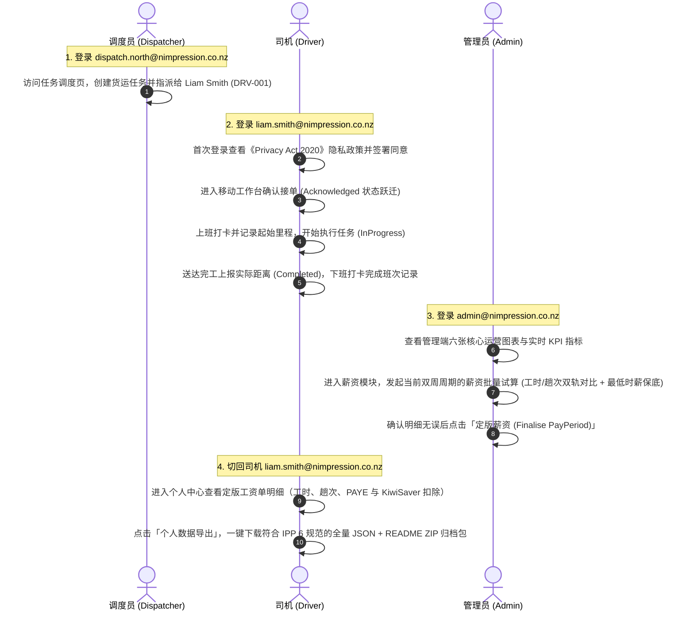

# Nimpression Ops — 智能运输与合规管理平台

[English](README.md) | [简体中文](README.zh-CN.md)

> 面向新西兰本地货运物流的智能排班考勤、薪资试算、合规追踪与实时派单平台。  
> 后端采用 **.NET 10（Minimal API + 领域驱动设计 / Clean Architecture）** 构建，前端采用 **Angular 22（Signals + Zoneless + PrimeNG）** 构建，深度对齐新西兰《Privacy Act 2020》隐私与数据主权合规标准。

---

## 项目概览与核心特性

Nimpression Ops 为中小型运输车队提供全链路数字化运营能力：

- **智能调度与状态机履约**：严格领域状态机（Draft -> Assigned -> Acknowledged -> InProgress -> Completed），支持离线操作幂等重放、跨区域指派合规预警、超期未接单预警。
- **合规工时与双轨薪资试算**：精准对齐新西兰《Holidays Act 2003》与最低工资标准（NZ Minimum Wage Act）。支持工时制与趟次制双轨试算、择优发放并保留败方明细、最低时薪自动差额保底（Minimum Wage Top-up）。
- **字段级加密与数据主权**：严格对齐《Privacy Act 2020》13 条 IPP 原则。个人身份信息（PII）采用 AES-256-GCM 强加密（带 `enc:v1:` 前缀），支持不可逆司机数据匿名化（保持历史财务与事故统计聚合恒定）、保留期清理（默认 Dry-Run 安全评估）、IPP 6 个人数据全量 ZIP 归档导出。
- **实时通信与信号失效架构**：基于 SignalR 的实时协同系统。推送仅作为轻量级缓存失效信号（Invalidation Signal），客户端重拉权威数据，杜绝通道异常导致的业务状态错乱。
- **多语言与无障碍设计**：全站中英双语字典覆盖（en-NZ / zh-CN），深色 / 浅色模式无缝切换，色彩对比度严格满足 WCAG 2.1 AA 标准（普通文本 >= 4.5:1）。

---

## 技术架构

```
                        +-----------------------------------------+
                        |      Client Applications (Web / PWA)    |
                        |   Angular 22 · Signals · Zoneless · CSS |
                        +--------------------+--------------------+
                                             |
                   HTTP/JSON REST Calls      |  SignalR Push (Invalidation)
                                             v
                        +-----------------------------------------+
                        |       Nimpression.Api (.NET 10)         |
                        | Minimal API · JWT · Rate Limiter · Auth |
                        +--------------------+--------------------+
                                             |
                                             v
                        +-----------------------------------------+
                        |     Nimpression.Application (MediatR)   |
                        | Commands · Queries · Pipeline Behaviors |
                        +--------------------+--------------------+
                                             |
                                             v
                        +-----------------------------------------+
                        |       Nimpression.Domain (Core)         |
                        | Entities · Aggregates · Value Objects   |
                        +--------------------+--------------------+
                                             |
                                             v
                        +-----------------------------------------+
                        |     Nimpression.Infrastructure (EF)     |
                        | PostgreSQL 16 · MinIO S3 · Mailpit SMTP |
                        +-----------------------------------------+
```

| 层次 | 技术选型 | 关键设计与职责 |
|---|---|---|
| **前端展现层** | Angular 22 (`^22.1.0`), PrimeNG, ECharts | Zoneless 架构，全面采用 Angular Signals 响应式状态管理，双套 Shell 布局（桌面端 Admin/Dispatcher Shell 与移动端 Driver Shell），Vitest 单元测试。 |
| **接入层 / API** | ASP.NET Core 10 Minimal API | 采用 `IEndpointModule` 程序集自动扫描挂载，无控制器开销；全局固定窗口 IP 限流；HttpOnly 严格 Cookie 令牌轮转。 |
| **应用层** | MediatR, FluentValidation | CQRS 架构；管道行为实现事务管理（`ICommandMarker`）、审计追踪（`IAuditableCommand`）与模型校验；Result 模式统一表达业务分支（不抛异常）。 |
| **领域层** | C# 纯领域模型（POCO） | 零外部三方依赖；聚合根保障状态机完整跃迁，强类型值对象（Money, Kilometres, Rego 等）自内聚校验规则。 |
| **基础设施层** | EF Core 10, PostgreSQL 16 | AES-256-GCM 字段级透明加解密；Transactional Outbox 模式保证领域事件与数据写入原子性；不可篡改只读审计日志触发器。 |

---

## 十一道构建期架构守卫

本项目在构建链（`pnpm build`）中内置了 **十一道自动化架构守卫**。每道守卫均源自开发与迭代过程中真实的事故与反思（详见 `_design/09-gap-analysis.md`），确保规范不只停留在文档中，而是具备机械化的阻断约束：

| 守卫脚本 | 校验目标与范围 | 事故背景与拦截依据 |
|---|---|---|
| `check-hardcoded-secrets.mjs` | 扫描全仓 `.cs/.ts/.js/.json/.yml/.sh`，严禁硬编码生产密码、私钥、JWT Secret 与数据库连接串。 | 彻底防止凭据泄漏。强制使用环境变量或显式 `dev-only-insecure...` / `// allow-hardcoded: <reason>` 标记。曾拦截 High 级依赖漏洞及开发期凭据硬编码。 |
| `check-api-contract.mjs` | 静态扫描前端所有 `/api/` 路由调用，与后端 Minimal API 真实注册的路由集合做差集校验。 | **W18 事故**：前端 mock 单元测试全绿，但实际调用了 9 个后端不存在的端点，导致司机端上线后全空。该守卫可在修复前精准报出这 9 处缺失。 |
| `check-enum-contract.mjs` | 校验 C# 枚举成员与 TypeScript 联合类型 / 字典映射在命名与取值上 100% 对齐。 | **W11 事故**：后端枚举序列化为数字，而前端声明为字符串联合类型，导致 11 个页面的状态徽章全部渲染错误。 |
| `check-i18n.mjs` | 校验中英双语词典（`en-NZ.json` 与 `zh-CN.json`）的键树完全对称。 | 防止漏翻或新增语言包词条不对称导致页面文案回退失败或渲染空白。 |
| `check-i18n-keys.mjs` | 静态扫描全站 HTML 模板与 TS 源码中消费的所有 i18n 键（含动态前缀展开），确保均在语言包中存在。 | **W31 事故**：词典对称性校验（Guard 4）存在盲区——当两本词典同时遗漏 10 处键名时差集仍为空，导致线上直接把原始 key 渲染给用户。该守卫实现双向闭环。 |
| `check-emoji.mjs` | 扫描代码、模板、文档与配置，严禁出现任何 Emoji 字符。 | **项目硬规范**：Emoji 存在跨平台渲染不一致、无障碍屏幕阅读器朗读过长、视觉风格不可控等问题。强制使用内联 SVG（`currentColor` + `aria-hidden="true"`）或纯文本。 |
| `check-design-tokens.mjs` | 校验 SCSS/CSS 中所有 `var(--token)` 变量引用在设计系统变量定义中真实存在。 | 防止拼写错误或引用悬空未定义的 CSS 变量导致界面样式塌陷。 |
| `check-hardcoded-colors.mjs` | 扫描所有 `.scss` 与 `.html` 样式定义，严禁出现 `#hex`、`rgb()`、`rgba()`、`hsl()` 等硬编码色值。 | **W31 事故**：开发者绕过设计系统令牌直接硬编码色值，导致令牌库形同虚设。该守卫强制所有样式消费设计系统令牌，合法特殊场景需显式单行注释豁免。 |
| `check-contrast.mjs` | 自动解析亮色与暗色模式下的颜色令牌层级，按 WCAG 2.1 算法计算文本与背景对比度。 | **W21 事故**：虽然变量化，但亮色主按钮 `--text-inverse` 压在 `--color-primary` 上对比度仅 4.10:1（未达到 WCAG AA 正文 4.5:1 要求）。 |
| `check-realtime-wiring.mjs` | 扫描业务列表与指标视图组件，确保所有关联实时变更的组件均已订阅 SignalR 失效信号。 | **W19 事故**：后端 SignalR 推送链路就绪，但前端 7 个列表页面零订阅，用户必须手动刷新页面才能看到最新状态。 |
| `check-dispatch-lifecycle-events.mjs` | 扫描领域层 `JobTask` 聚合根中的所有状态变更方法，确保每次状态跃迁均显式调用 `AddDomainEvent`。 | **W24 事故**：状态机流转时若遗漏领域事件发射，将导致实时推送与事务 Outbox 消息丢失，产生接缝断环。 |

---

## 角色权限说明与演示账号

系统严格基于 RBAC（基于角色的访问控制）与数据主权隔离设计。三个角色的权限划分如下：

| 角色 | 演示邮箱 | 初始密码 | 核心权限与职责 | 严格权限限制 |
|---|---|---|---|---|
| **Admin（系统管理员）** | `admin@nimpression.co.nz` | `Passw0rd!demo` | 全局最高管理权限：运营看板与 6 张核心图表、双周薪资周期创建/试算/定版/作废、司机档案与费率维护、车辆资产与合规状态管理、不可逆司机数据匿名化、数据保留策略清理、全局不可篡改审计日志多维检索与 CSV 导出、新闻公告发布、邮件模板管理。 | 无。 |
| **Dispatcher（调度员）** | `dispatch.north@nimpression.co.nz`<br>`dispatch.south@nimpression.co.nz` | `Passw0rd!demo` | 调度与运力现场运营：创建派单任务、指派司机与车辆、处理跨区域指派警告、取消任务、超期未接单预警监控、司机派单资格与驾照到期预警查看、车辆分派与释放、运营区域管理、交通罚单审核（开始审核/接受/争议/减免）、事故上报与理赔跟踪、外部伙伴联系人维护（保险/维修/年检）、邮件发送日志查询与失败重发、手动触发合规预警扫描。 | **薪资模块完全不可见（严格返回 403 Forbidden）**：禁止查询薪资周期、禁止试算/定版/作废薪资、禁止查看全员与司机个人工资单及费率；禁止创建/修改司机档案与费率；禁止新增/修改车辆资产与维保；禁止编辑邮件模板；禁止查看全局审计日志；禁止执行数据清理与匿名化。 |
| **Driver（物流司机）** | `liam.smith@nimpression.co.nz`（DRV-001） | `Passw0rd!demo` | 移动端个人工作台：班次上下班打卡（记录 GPS，支持无位置降级打卡）、查看本人派单任务（`/my-tasks`）、确认接单（`Acknowledged`）、开始任务（`InProgress`，上报起始里程）、完工确认（`Completed`，上报实际距离/终点里程）、上报车辆里程表读数与仪表照片、提交交通罚单与现场照片、上报安全事故与事故照片、查看本人已定版工资单明细、NZ Privacy Act IPP 6 个人全量数据 ZIP 导出、签署隐私政策、自助修改个人联系信息。 | 严格租户/用户数据隔离：访问其他司机任务、工单、打卡记录、罚单或工资单均返回 403 Forbidden；严禁自行修改工号、费率、驾照到期日或雇佣状态。 |

---

## 五分钟快速上手（Quickstart）

### 1. 前置环境要求

在本地启动前，请确保环境中已安装：
- **容器运行时**：[Colima](https://github.com/abiosoft/colima)（推荐 `colima start --cpu 4 --memory 8`）或 Docker Desktop
- **Task 任务运行器**：[Taskfile](https://taskfile.dev)（`brew install go-task/tap/go-task`）
- **.NET SDK**：.NET 10.0+（`dotnet --version`）
- **Node.js & 包管理器**：Node.js 22+ 及 pnpm 11+（`corepack enable`）

---

### 2. 启动命令

```bash
# 1. 启动 Docker 依赖容器（PostgreSQL 16 / Mailpit / MinIO S3）并初始化存储桶
task up

# 2. 将数据库迁移应用到本地 PostgreSQL 数据库
task migrate

# 3. 灌入 90 天确定性演示业务数据（13 用户 / 10 司机 / 11 车辆 / 6 区域 / 659 任务 / 642 班次 / 60 工资单）
task seed

# 4. 一键启动全栈开发环境（同时启动 .NET 10 后端与 Angular 22 前端）
task dev
```

运行 `task dev` 就绪后，各服务访问入口如下：

| 服务 | 访问地址 | 默认账号 / 说明 |
|---|---|---|
| **前端控制台 (Angular 22)** | [http://localhost:4200](http://localhost:4200) | 演示账号见上方角色表格，统一密码 `Passw0rd!demo` |
| **后端 API (.NET 10)** | [http://localhost:5080](http://localhost:5080) | 健康检查探针: `/health`，OpenAPI 契约: `/openapi/v1.json` |
| **本地邮件捕获 (Mailpit)** | [http://localhost:8025](http://localhost:8025) | 实时捕获系统通知、事故报案与合规提醒邮件（SMTP 端口: 1025） |
| **对象存储控制台 (MinIO)** | [http://localhost:9001](http://localhost:9001) | 账号: `nimpression` / 密码: `devonly_change_me`（S3 API: 9000） |
| **线上使用手册 (离线静态页)** | [http://localhost:4200/manual.html](http://localhost:4200/manual.html) | 纯原生 CSS 双模式手册，登录页底部亦有直接入口 |

> **提示**：按 `Ctrl + C` 可干净停止前后端开发进程。如需彻底清空本地数据库并删除数据卷，请运行 `task nuke`。

---

## 端到端业务闭环体验（E2E Walkthrough）

访问 [http://localhost:4200](http://localhost:4200)，可按照以下典型业务流程完整体验系统闭环：



---

## 生产部署、CI/CD 与安全体系

### 1. 生产部署架构

本项目在线演示环境采用高度收敛的安全架构：

- **Cloudflare Tunnel（无入站端口暴露）**：生产主机未开放任何公网入站端口（80/443 全部关闭），所有公网流量经由 Cloudflare 边缘节点加密隧道接入本地 Nginx 反向代理。
- **Self-Hosted Runner 安全策略**：本代码仓库为公开仓库，GitHub Actions self-hosted runner 直接运行在生产主机（`node-jp`，Linux ARM64）。为杜绝外部恶意 Pull Request 在生产机执行任意代码，**部署流水线（`deploy.yml`）严禁配置 `pull_request` 触发器**，仅接受已具备仓库写入权限的维护者推送的 `v*` tag 或经过鉴权的 `workflow_dispatch` 手动触发。
- **自包含二进制发布**：后端编译为 `linux-arm64` 独立自包含二进制（Self-Contained），零生产宿主机 .NET SDK 依赖。

### 2. CI/CD 流水线与自动回滚机制

- **持续集成（CI - `ci.yml`）**：每次推送到 `main` 分支或提交 Pull Request 时触发。在独立 Ubuntu 容器中运行代码格式化检查、前后端全量构建、十一道架构守卫扫描、.NET 单元与集成测试（生成代码覆盖率报告，Domain 层行覆盖率保持 >= 90%）。
- **持续部署（CD - `deploy.yml`）**：推送 `v*` tag 触发生产发布（当前版本：`v1.6.4`）。
  1. 运行前后端构建与全量测试套件；
  2. 生成自包含二进制产物并同步前端静态资源到 `/opt/nimpression/web/`；
  3. 执行数据库迁移指令（`Nimpression.Api migrate`）；
  4. 原子切换可执行二进制文件（当前版本备份至 `/opt/nimpression/api-old`），重启 systemd 守护进程；
  5. **自动化健康检查与故障回滚**：部署脚本持续对 `http://127.0.0.1:5080/health` 发起存活探测（最多重试 30 次 / 150 秒）。若健康检查超时或失败，**立即自动将二进制回滚至 `api-old` 并重启服务**，确保线上服务零中断；
  6. 验证公网可达性与手册页面状态码。

- **线上演示站点**：[https://nimpression.a-dobe.club/](https://nimpression.a-dobe.club/)
- **线上使用手册**：[https://nimpression.a-dobe.club/manual.html](https://nimpression.a-dobe.club/manual.html)

---

## 常用开发任务清单（Task 命令）

本项目使用 `Taskfile.yml` 统一管理全部开发与验证任务：

| 命令 | 描述 |
|---|---|
| `task up` | 启动全部依赖容器（PostgreSQL 5432 / Mailpit 8025 / MinIO 9001）并等待健康 |
| `task down` | 停止依赖容器（保留数据卷） |
| `task nuke` | 停止容器并**彻底删除**本地数据卷与 `.data` 目录（不可逆重置） |
| `task build` | 聚合构建：同时构建 .NET 后端与 Angular 前端 |
| `task build:server` | 构建 .NET 10 后端解决方案（开启 `TreatWarningsAsErrors=true`） |
| `task build:web` | 构建 Angular 22 前端工程（串行执行十一道构建期架构守卫） |
| `task test` | 聚合测试：运行后端全量测试与前端全部测试 |
| `task test:server` | 运行 .NET 全部测试（排除挂钟时序测试） |
| `task test:unit` | 仅运行 .NET 单元测试（极速反馈，无需启动 Docker 容器） |
| `task test:integration` | 运行 .NET 集成测试（自动通过 Testcontainers 启动隔离 PostgreSQL 容器） |
| `task test:timing` | 运行挂钟时序侧信道集成测试（要求低负载基准环境） |
| `task test:web` | 运行 Angular 单元测试及守卫回归测试套件 |
| `task test:e2e` | 运行 Playwright 前端端到端测试 |
| `task coverage` | 生成合并代码覆盖率报告（输出至 `./artifacts/coverage`） |
| `task migrate` | 将 EF Core 迁移脚本应用到本地数据库 |
| `task migrate:add -- <Name>` | 新增数据库迁移（例如 `task migrate:add -- AddNewField`） |
| `task migrate:down -- <Name>` | 回滚数据库迁移到指定历史版本 |
| `task seed` | 灌入 90 天确定性演示业务数据（13 用户 / 10 司机 / 11 车辆 / 6 区域 / 659 任务 / 642 班次 / 60 工资单） |
| `task dev` | **一键启动全栈开发环境**（依赖 + 后端 API 5080 + 前端 Dev Server 4200） |
| `task verify` | 提交前全量自检：执行 `task build` 与 `task test` |
| `task fmt` | 自动格式化前后端代码（.NET C# + 前端 TypeScript/HTML/SCSS/JSON） |
| `task fmt:check` | 校验代码格式是否符合规范（CI 静态检查使用，不修改文件） |
| `task doctor` | 运行开发环境依赖自检脚本（检查 .NET / Node / pnpm / Colima / Docker 及端口占用） |
